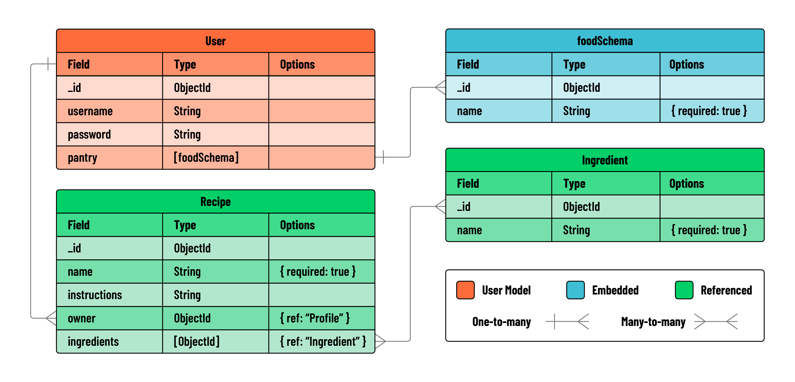

<h1>
  <span class="headline">MEN Stack Relating Data Lab Cookbook</span>
  <span class="subhead">Exercise: Referencing Related Data</span>
</h1>

## Introduction

In this lab you'll create the Cookbook app, a dynamic recipe organization tool tailored for cooking enthusiasts! For this exercise, you'll be developing a web application that's all about managing recipes and their ingredients. You'll practice referencing related data schemas in MongoDB with two models - `Recipe` and `Ingredient`. Users will have the ability to perform full CRUD operations on recipes, manage their recipe collections, and explore other users' recipes for inspiration.

**MVP: Your primary task is to implement full CRUD operations for the `Recipe` model, using referencing to associate it with ingredients. Full CRUD is not necessary for the `Ingredient` model.**

## User stories and application planning

Use the following user stories to guide the functionality and features of your application:

- As a User (AAU), I want to sign up for an account and sign in, so that I can access my personal user profile and manage my recipes.
- AAU, I want an easy and consistent way to navigate through the site, whether I am signed in or not. I need to quickly access options to sign up, sign in, view my recipes, or sign out, depending on my current status.
- AAU, I need a dedicated page to view all my recipes, to easily manage and review what I have created.
- AAU, I want to see the full details of each recipe I create.
- AAU, I want to easily find and click on an 'Add New Recipe' link, which takes me to a form for adding new recipes to my collection.
- AAU, after filling out the recipe form, I want to submit it and receive confirmation that the recipe has been saved.
- AAU, I need the ability to edit and delete recipes in my collection, allowing me full control over managing my data.
- AAU, I want to be able to add new ingredients to my recipe manager. This way, I can keep track of the different ingredients I use across various recipes.
- AAU, when adding a new recipe, I want an option to quickly add ingredients that are not already in my list. This will streamline the process of recipe creation, ensuring I can include all necessary ingredients without navigating away from the recipe form.
- AAU, I am interested in viewing a list of all other app users, to foster a sense of community within the app.
- AAU, I want the option to click on another user's profile and view all the recipes they have created, to exchange ideas or find inspiration for my own collection.

## Data modeling and ERD

In this lab, your task is to create two primary models: `Recipe` and `Ingredient`. These models represent the core components of your Cookbook app. The `Recipe` model will reference the `Ingredient` model to create a comprehensive list of ingredients for each recipe.

### Create the `Recipe` schema

Create a new file in `models` called `recipe.js`. Create a mongoose schema with the following properties:

| Property     | Type                             | Required | Description                                       |
| ------------ | -------------------------------- | -------- | ------------------------------------------------- |
| name         | String                           | true     | The name of the recipe.                           |
| instructions | String                           | false    | The cooking instructions for the recipe.          |
| owner        | mongoose.Schema.Types.ObjectId   | true     | A reference to the `User` model.                  |
| ingredients  | [mongoose.Schema.Types.ObjectId] | false    | An array of references to the `Ingredient` model. |

### Create the `Ingredient` schema

Create a new file in `models` called `ingredient.js`. Create a mongoose schema with the following properties:

| Property | Type   | Required | Description                 |
| -------- | ------ | -------- | --------------------------- |
| name     | String | true     | The name of the ingredient. |

### Referencing Data

In this lab, the `Recipe` model will reference the `Ingredient` model using an array of ObjectIds. Each recipe will be associated with a `User`, thereby creating a relationship between users and their collections of recipes and ingredients.

- You will be referencing the `Recipe` schema within the `User` schema, establishing a one-to-many relationship

- You will be referencing the `Ingredient` schema within the `Recipe` schema, establishing a many-to-many relationship

An ERD (Entity-Relationship Diagram) will help you visualize the relationships between these models:



In this diagram, you can see how each `Recipe` is connected to a `User` and how `Ingredients` are associated with `Recipes`. This structure forms the backbone of your Cookbook application.

## Define RESTful routes for managing data

Use the following charts as guides when building your RESTful routes.

### Recipe routes

| Action | Route                     | HTTP Verb |
| ------ | ------------------------- | --------- |
| Index  | `/recipes`                | GET       |
| New    | `/recipes/new`            | GET       |
| Create | `/recipes`                | POST      |
| Show   | `/recipes/:recipeId`      | GET       |
| Edit   | `/recipes/:recipeId/edit` | GET       |
| Update | `/recipes/:recipeId`      | PUT       |
| Delete | `/recipes/:recipeId`      | DELETE    |

### Ingredient routes

| Action | Route                             | HTTP Verb |
| ------ | --------------------------------- | --------- |
| Index  | `/ingredients`                    | GET       |
| New    | `/ingredients/new`                | GET       |
| Create | `/ingredients`                    | POST      |
| Show   | `/ingredients/:ingredientId`      | GET       |
| Edit   | `/ingredients/:ingredientId/edit` | GET       |
| Update | `/ingredients/:ingredientId`      | PUT       |
| Delete | `/ingredients/:ingredientId`      | DELETE    |

> Note: you may **not** need **_all_** of these routes and views in your application

## Structure and Setup

### 1. Build the Controllers

- Create files for the `recipes` and `ingredients` controllers in the controllers directory.
- Require all essential modules at the top of each controller file.
- Export your routers for use in `server.js`.

```javascript
// controllers/recipes.js

const express = require('express');
const router = express.Router();

const User = require('../models/user.js');
const Recipe = require('../models/recipe.js');

// router logic will go here - will be built later on in the lab

module.exports = router;
```

Repeat this process for the `ingredients` controller.

### 2. Use the controllers in server

- Import the `recipes` and `ingredients` controllers in `server.js`.
- Use middleware to direct incoming requests to the respective controllers.

```js
// server.js

const authController = require('./controllers/auth.js');
const recipesController = require('./controllers/recipes.js');
const ingredientsController = require('./controllers/ingredients.js');
```

```js
// server.js

// below middleware
app.use('/auth', authController);
app.use('/recipes', recipesController);
app.use('/ingredients', ingredientsController);
```

### 3. Add middleware

Now you'll need to add two middleware functions to your application:

- one that restricts access to logged-in users only
- one that makes the user object available to view templates via `res.locals`.

Create a `middleware` folder in your project root. Inside this folder:

Create a file named `is-signed-in.js`.

- This function should include logic that checks if `req.session.user` exists, and if it does, allows the request to continue on the normal chain by invoking `next()`
- If a user session does not exist, the user should be redirected to the sign in page.

```js
// is-signed-in.js

const isSignedIn = (req, res, next) => {
  if (req.session.user) return next();
  res.redirect('/auth/sign-in');
};

module.exports = isSignedIn;
```

Create a file named `pass-user-to-view.js`.

- This function should include logic that assigns `req.session.user` to `res.locals.user` (available in our views). If no user is found, we set it to `null`. Then allow the request to continue on the normal chain by invoking `next()`.

```js
// middleware/pass-user-to-view.js

const passUserToView = (req, res, next) => {
  res.locals.user = req.session.user ? req.session.user : null;
  next();
};

module.exports = passUserToView;
```

Import and include both middleware functions above all of the routes and controllers in `server.js.`.

```js
// server.js
const isSignedIn = require('./middleware/is-signed-in.js');
const passUserToView = require('./middleware/pass-user-to-view.js');
```

These middleware functions should run before any routes that check for a valid user or require a user to be signed in to view a page.

```js
// server.js

app.use(passUserToView);
app.use('/auth', authController);
app.use(isSignedIn);
app.use('/recipes', recipesController);
app.use('/ingredients', ingredientsController);
```

You are now ready to begin building your protected routes.

## Build the `nav` partial

Implement the following user story:

> AAU, I want an easy and consistent way to navigate through the site, whether I am signed in or not. I need to quickly access options to sign up, sign in, view my recipes, or sign out, depending on my current status.

Currently, the links for "Sign up" or "Sign in" are hardcoded onto the homepage. You will need to refactor and move these links into a nav bar partial for a better user experience.

- Create a directory called `partials` inside the `views` directory.
- Inside partials, create a new file called `_navbar.ejs`

Create a nav inside `_navbar.ejs`:

- This nav should have a `home` link displayed on every page.
- Other links should be rendered conditionally based on whether or not a `user` is signed in.
- If a `user` is signed in, they should see links to "View my Recipes" or "Sign Out".
- If a `user` is not signed in, they should see links to "Sign In" or "Sign Up".

For the best user experience, you'll want to include this nav partial at the top of all of your existing templates.

```html
<%- include('./partials/_navbar.ejs') %>
```

With the nav partial included, you can replace the hardcoded links in the homepage starter code with a partial and some simple welcome text.

```html
<body>
  <%- include('./partials/_navbar.ejs') %>
  <h1>Welcome to CookBook</h1>
</body>
```

## Build the `recipe` routes and views

With the main structure of the application complete, it's time to start building out the `recipe` pages guided by user stories.

### 1. Conceptualize the `index` route for Recipes

For your landing page, you will use:

- `GET` `/recipes`

Implement the following user story:

> AAU, I need a dedicated page to view all my recipes, to easily manage and review what I have created.

### 2. Define the `index` route for Recipes

- In your `recipes` controller, create a new `index` route to serve as the landing page. Test by visiting `localhost:3000/recipes`.
- This route should `res.render()` an `index.ejs` view, showing all recipes associated with a specific user.

```js
router.get('/', async (req, res) => {
  res.render('recipes/index.ejs');
});
```

### 3. Render the `index` template for Recipes

- Create a new directory called `recipes` inside of the `views` directory. This will hold the templates for your `recipes` pages.

- Create an `index.ejs` file in `recipes`. Add a basic HTML boilerplate to this file and include a list to display all recipes.

```html
<!DOCTYPE html>
<html lang="en">
  <head>
    <meta charset="UTF-8" />
    <meta name="viewport" content="width=device-width, initial-scale=1.0" />
    <title>My Recipes</title>
  </head>
  <body>
    <h1>Welcome to My Recipes</h1>
  </body>
</html>
```

- Test your new route in the browser to confirm that everything renders correctly.

## Build the `new` recipe page

Implement the following user story:

> AAU, I want to easily find and click on an 'Add New Recipe' link, which takes me to a form for adding new recipes.

### 1. Conceptualize the `new` recipe route

For your `new` recipe page, you will use:

- `GET` `/recipes/new`

### 2. Define the `new` recipe route

This route will render a page that displays a form to add a new recipe.

- In `controllers/recipes.js`, create a `new` route.
- This route should `res.render()` a `new.ejs` view.
- Add an "Add New Recipe" link to the `index` page and point it to your new route.

### 3. Render the `new` recipe template

- Create a new template called `new.ejs` in the `views/recipes` directory.
- This view should display a form to add a new recipe. Design your form based on the `recipeSchema` defined earlier.
- The form action will `POST` to the `create` route.

## Build the `create` recipe functionality

Implement the following user story:

> AAU, after filling out the recipe form, I want to submit it and receive confirmation that the recipe has been saved.

### 1. Conceptualize the `create` recipe route

This route will:

- `POST` to `/recipes`

### 2. Define the `create` recipe route

This route will create new `recipes` in the user's collection.

- Look up the user from `req.session`
- Create a new `Recipe` object using `req.body` and assign the user's `_id` as the owner.
- Save the new `Recipe`.
- Redirect back to the recipe `index` view.
- If any errors, log them and redirect back home `/`.

### Setting the owner during recipe creation:

When a recipe is created, set the `owner` field to the current user's ObjectId. This is usually available in the session data if the user is logged in.

Example:

```js
// In controllers/recipes.js, within the create route

router.post('/', async (req, res) => {
  try {
    const newRecipe = new Recipe(req.body);
    newRecipe.owner = req.session.user._id;
    await newRecipe.save();
    // Redirect to recipe index or show page
  } catch (error) {
    // Handle errors
  }
});
```

### Future access control

To ensure that users can only manage their own recipes, you may choose to implement access control checks. Before allowing edit or delete operations, verify that the recipe's `owner` matches the current user's ID.

```js
// Example of an access control check
if (recipe.owner.equals(req.session.user._id)) {
  // Proceed with edit or delete operation
} else {
  // Redirect or show an error message
}
```

## Add recipes to `index` page

Implement the following user story:

> AAU, I need a dedicated page to view all my recipes, to easily manage and review what I have created.

### 1. Build the `index` functionality

Refactor the `index` route to send all recipes created by a user to the `index` view:

- Look up the current user's recipes
- Send all recipes to the view via `res.locals`
- If any errors, log them and redirect back home `/`.

### 2. Update the `index` template

- Use conditional rendering to display a list of recipes or a message that reads "You have not created any recipes yet."

## Build the `show` page

Implement the following user story:

> AAU, I want to see the full details of each recipe I create.

### 1. Conceptualize the `show` recipe route

This route will:

- `GET` `/recipes/:recipeId`

### 2. Define the `show` recipe route

- Define the `show` route in the `recipes` controller

### 3. Link each recipe to its show `show` page to the `index` template

- Link each individual recipe to the `show` page with `/recipes/:recipeId`

### 4. Build the `show` recipe functionality

This route will show the individual recipe from the user's collection.

- Look up the recipe using the id supplied by `req.params`
- This route should `res.render()` a `show.ejs` view
- Send the recipe to the view via `res.locals`
- If any errors, log them and redirect back home `/`.

### 5. Render the `show` recipe template

- Create a new template called `show.ejs` in the `views/recipes` directory.
- This view should display the user's full recipe.

## Build `delete` route

Implement the following user story:

> AAU, I need the ability to edit and delete recipes, allowing me full control over managing my creations.

### 1. Conceptualize the `delete` recipe route

This route will:

- `DELETE` to `/recipes/:recipeId`
- Add `?_method=DELETE` to utilize the method override middleware

### 2. Define the `delete` recipe route

- Define the `delete` route in the `recipes` controller

### 3. Add `delete` link to the `index` template

- Add a simple form element to each recipe that posts to the `delete` route
- The form should appear as a single `delete` button in the UI

### 4. Build the `delete` recipe functionality

This route will delete the recipe from the user's collection.

- Look up the recipe using the id supplied by `req.params`
- Use the `.deleteOne()` method to delete the recipe
- Redirect to `/recipes`
- If any errors, log them and redirect back home `/`.

## Build the `edit` recipe page

Implement the following user story:

> AAU, I need the ability to edit and delete recipes, allowing me full control over managing my creations.

### 1. Conceptualize the `edit` recipe route

For your `edit` recipe page, you will use:

- `GET` `/recipes/:recipeId/edit`

### 2. Define the `edit` recipe route

This route will render a page that displays a form to edit a specific recipe.

- In `controllers/recipes.js`, create an `edit` route.
- This route should `res.render()` an `edit.ejs` view.
- Find the current recipe from the id supplied by `req.params` and provide it to the edit form.
- Add an edit link to each recipe item rendered on the index page.
- If any errors, log them and redirect back home `/`.

### 3. Render the `edit` recipe template

- Create a new template called `edit.ejs` in the `views/recipes` directory.
- This view should display a form to edit a specific recipe. Design your form based on the `recipeSchema`.
- Auto-fill the form with the `recipe` data supplied from the route.
- The form action will `POST` to the `update` route.

## Build the `update` recipe functionality

### 1. Conceptualize the `update` recipe route

This route will:

- `POST` to `/recipes/:recipeId`
- Add `?_method=PUT` to utilize the method override middleware

### 2. Define the `update` recipe route

- Define the update route in the `recipes` controller

### 3. Build the `update` recipe functionality

This route will update a specific recipe:

- Find the current recipe from the id supplied by `req.params`
- Use the `.save()` method, updating the current recipe to reflect the new form data on `req.body`
- Redirect back to the `show` view
- If any errors, log them and redirect back home `/`.

Now that you have full crud functionality for recipes, test each route end to end and check for errors before moving on.

<br>

## Connect `Ingredients` to `Recipes`

In this part of the lab, you'll integrate an `Ingredient` model into the `Recipe` creation and management process.

**We've intentionally provided less guidance in this section to encourage creative problem-solving.**

Implement the following user stories:

> AAU, I want to be able to add new ingredients to my recipe manager. This way, I can keep track of the different ingredients I use across various recipes.
> AAU, when adding a new recipe, I want an option to quickly add ingredients that are not already in my list. This will streamline the process of recipe creation, ensuring I can include all necessary ingredients without navigating away from the recipe form.

After you've achieved full CRUD functionality for recipes, your next step will be to integrate ingredients. Start by creating a simple list of all ingredients `GET /ingredients` and a form to add new ones `POST /ingredients`. Then, focus on allowing users to add these ingredients to their recipes. How and where you choose to make those relationships is up to you.

### Ingredient routes and logic

**Note:** It might not be necessary to develop full RESTful routes for `Ingredient`.

Instead, consider:

- You might only need an index `GET /ingredients` and a create route `POST /ingredients` for ingredients. How would you structure these to efficiently manage ingredient data?

- Full views for each ingredient route may not be necessary. Consider combining the index and create form on the same page `ingredients/index.ejs`. How can you design this page to be both informative and functional?

- Integrate ingredient functionalities directly within recipe pages, such as allowing users to add new ingredients while creating or editing a recipe.

### Simplifying recipe and ingredient integration

- Consider that you may only need one or two additional routes in your `recipes` controller to relate ingredients to recipes. For instance, a single route could handle adding ingredients directly from the recipe show or edit page.

- If you opt for a separate view for adding ingredients to a recipe, an additional route to render this view might be useful. How would this fit into the overall flow of your application?

- Consider UI elements like [checkboxes](https://www.w3schools.com/tags/att_input_type_checkbox.asp), or a [select multiple](https://www.w3schools.com/tags/att_select_multiple.asp) element for adding ingredients to recipes in a form. Consider which is the best approach and why?

- Remember not to over complicate your routing. Focus on what's necessary for a good user experience and efficient functionality.

### Handling ingredient duplication

- When adding ingredients to recipes, think about how you might unintentionally allow for duplicate ingredients. What are some strategies to prevent this, either in the view or within your route logic?

- Would you implement a check in the view to inform users of existing ingredients, or would you handle duplicates in the backend logic during ingredient addition?

As you progress through this section of the lab, keep in mind the simplicity and functionality of your application. While it might be tempting to create a comprehensive system for managing ingredients, sometimes less is more. Focus on the routes and views that are essential for a smooth user experience.

### Congrats! You have reached MVP! 🎉

<br>

## Add a Community page (Level Up)

There are two final `user` views to reach your final application. Building a community page for users to find each other and gain inspiration from the recipes of others.

Implement the following user story:

> AAU, I am interested in viewing a list of all other app users, to foster a sense of community and interaction within the app.

To meet this requirement you will need a new `users` controller and `views` directory for `users`.

- Create a simple `/users` controller with an `index` route to get all users.
- Connect your new controller in `server.js`
- Create a new directory inside of `views` called `users`.
- Add a new view called `index.ejs`
- Render a list of all users on the `index` page.
- Add a link to your nav partial that says "Explore Our Community". Link it to your new community page.

## View other users' `recipes`

Implement the following user story:

> AAU, I want the option to click on another user's profile and view all their recipes, to exchange ideas or find inspiration for my own recipes.

From the community page, users should be able to click on the names of other users and see their recipes. This requires one final route and view.

- Create a `show` route in your `/users` controller
- Create a `show.ejs` in the `users` views directory
- Add a link for each user's `show` page in the rendered community list.
- On each user's `show` page, render a list of that user's recipes.
- This list should be read-only.

Test your new community page.
